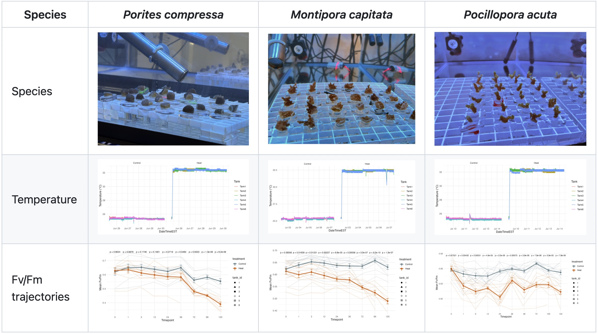

Short-term heat stress physiology & high-resolution gene expression time series performed on *Porites compressa*, *Montipora capitata*, and *Pocillopora acuta*.

**Highlights:**
- 3 reef-building coral species tested under heat stress
- Seven timepoints
- [Sampling](https://github.com/zdellaert/TimeSeries/blob/main/protocols/Sampling.md) and [extraction](https://github.com/zdellaert/TimeSeries/blob/main/protocols/Bulk_DNA_RNA_Extractions_Zymo_Quick_Miniprep.md) protocols

[→ Explore the code + data](https://github.com/zdellaert/TimeSeries)

